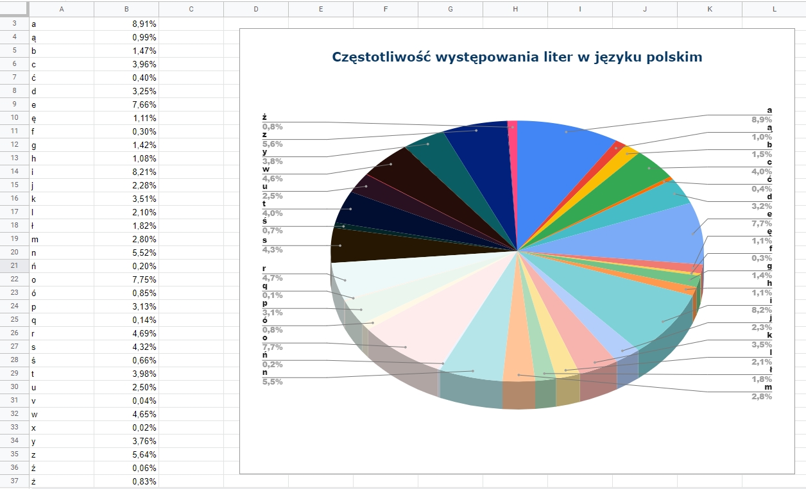
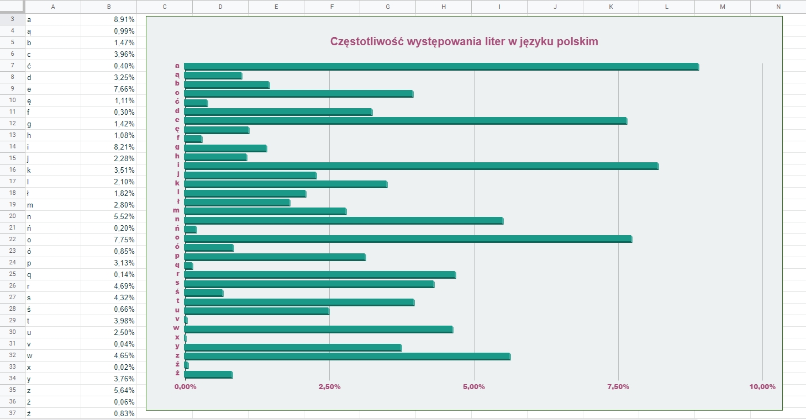
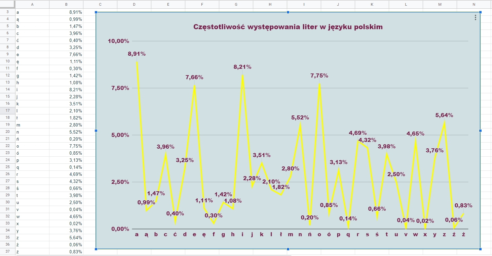

# Rozwiązanie
<h5>Na podstawie wykresu przedstawiającego czestotliwość liter w języku angielskim https://observablehq.com/@d3/bar-chart </h5>
<ol>
<li>Wykres kołowy</li>

<li>Wykres słupkowy</li>

<li>Wykres liniowy</li>

</ol>
